# WebApp3

目的
環境構築1: 作成したシステムの概略、動作確認の方法と結果
課題1: 動作確認の方法と結果
```
OPTIONS /submit HTTP/1.1
Host: localhost:3001
Connection: keep-alive
Accept: */*
Access-Control-Request-Method: POST
Access-Control-Request-Headers: access-control-allow-credentials,access-control-allow-origin,content-type
Origin: http://localhost:3000
User-Agent: Mozilla/5.0 (Windows NT 10.0; Win64; x64) AppleWebKit/537.36 (KHTML, like Gecko) Chrome/130.0.0.0 Safari/537.36 Edg/130.0.0.0
Sec-Fetch-Mode: cors
Sec-Fetch-Site: same-site
Sec-Fetch-Dest: empty
Referer: http://localhost:3000/
Accept-Encoding: gzip, deflate, br, zstd
Accept-Language: ja,en;q=0.9,en-GB;q=0.8,en-US;q=0.7

HTTP/1.1 200 OK
Server: Werkzeug/3.1.2 Python/3.13.0
Date: Fri, 08 Nov 2024 04:42:33 GMT
Content-Type: text/html; charset=utf-8
Allow: POST, OPTIONS
Access-Control-Allow-Origin: http://localhost:3000
Access-Control-Allow-Credentials: true
Access-Control-Allow-Headers: access-control-allow-credentials, access-control-allow-origin, content-type
Access-Control-Allow-Methods: DELETE, GET, HEAD, OPTIONS, PATCH, POST, PUT
Vary: Origin
Content-Length: 0
Connection: close
```

パケット総数は1773[byte]


環境構築2: 作成したシステムの概略、動作確認の方法と結果
課題2: 動作確認の方法と結果

```
GET /list HTTP/1.1
Host: localhost:3001
Connection: keep-alive
sec-ch-ua-platform: "Windows"
User-Agent: Mozilla/5.0 (Windows NT 10.0; Win64; x64) AppleWebKit/537.36 (KHTML, like Gecko) Chrome/130.0.0.0 Safari/537.36 Edg/130.0.0.0
Accept: application/json, text/plain, */*
sec-ch-ua: "Chromium";v="130", "Microsoft Edge";v="130", "Not?A_Brand";v="99"
sec-ch-ua-mobile: ?0
Origin: http://localhost:3000
Sec-Fetch-Site: same-site
Sec-Fetch-Mode: cors
Sec-Fetch-Dest: empty
Referer: http://localhost:3000/
Accept-Encoding: gzip, deflate, br, zstd
Accept-Language: ja,en;q=0.9,en-GB;q=0.8,en-US;q=0.7

HTTP/1.1 200 OK
Server: Werkzeug/3.1.2 Python/3.13.0
Date: Fri, 08 Nov 2024 06:38:23 GMT
Content-Type: text/html; charset=utf-8
Content-Length: 72
Access-Control-Allow-Origin: http://localhost:3000
Access-Control-Allow-Credentials: true
Vary: Origin
Connection: close

{"nickname": "hoge", "postmessage": "this is test", "posttime": "today"}
```

```WebSocket
GET /list HTTP/1.1
Host: localhost:3002
Connection: Upgrade
Pragma: no-cache
Cache-Control: no-cache
User-Agent: Mozilla/5.0 (Windows NT 10.0; Win64; x64) AppleWebKit/537.36 (KHTML, like Gecko) Chrome/130.0.0.0 Safari/537.36 Edg/130.0.0.0
Upgrade: websocket
Origin: http://localhost:3000
Sec-WebSocket-Version: 13
Accept-Encoding: gzip, deflate, br, zstd
Accept-Language: ja,en;q=0.9,en-GB;q=0.8,en-US;q=0.7
Sec-WebSocket-Key: +IofNf891WAdvvEdKvBaPw==
Sec-WebSocket-Extensions: permessage-deflate; client_max_window_bits

HTTP/1.1 101 
Upgrade: WebSocket
Connection: Upgrade
Sec-WebSocket-Accept: 6NlBz+lpAyFsPqh+E+kJyM61qrc=
Sec-WebSocket-Extensions: permessage-deflate; client_max_window_bits=15

.q.V..L..K.MU.RP..OOU.QP*./..M-.NL......(@.
.0.%..MnE.
~.e
..
F.F&
.fV..V..
..!.....
.1.f...@..(.H&.Z..TK3 ifb..T.....FqFZiz"!g.............W
```
パケット総数は1866[byte]
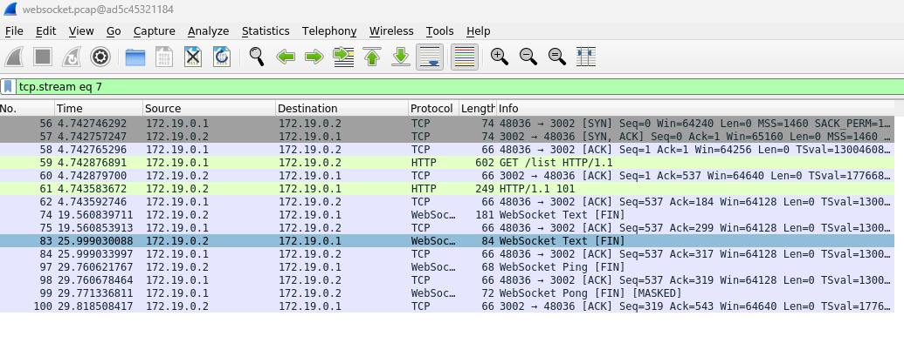

環境構築3: 作成したシステムの概略、動作確認の方法と結果
課題3: 動作確認の方法と結果
```
codespace ➜ /workspaces/webapp3-HIROSN0W/src (main) $ docker compose run --rm mqtt-sub mosquitto_sub  -u appuser -P UYII8ceNiICh -h mqtt-broker -t "+/+/+/+/temp" -v
snct/building1/3F/room1305/temp 28
snct/building1/3F/room1301/temp 25
snct/building1/2F/room1204/temp 24
```

```
codespace ➜ /workspaces/webapp3-HIROSN0W/src (main) $ docker compose run --rm mqtt-sub mosquitto_sub  -u appuser -P UYII8ceNiICh -h mqtt-broker -t "+/+/+/+/humi" -v
snct/building1/3F/room1305/humi 56
snct/building1/3F/room1301/humi 65
snct/building1/2F/room1204/humi 70
```
環境構築4: 作成したシステムの概略、動作確認の方法と結果
課題4: 動作確認の方法と結果

```
<mqtt_get>

GET / HTTP/1.1
Host: localhost:8080
Connection: Upgrade
Pragma: no-cache
Cache-Control: no-cache
User-Agent: Mozilla/5.0 (Windows NT 10.0; Win64; x64) AppleWebKit/537.36 (KHTML, like Gecko) Chrome/130.0.0.0 Safari/537.36 Edg/130.0.0.0
Upgrade: websocket
Origin: http://localhost:3000
Sec-WebSocket-Version: 13
Accept-Encoding: gzip, deflate, br, zstd
Accept-Language: ja,en;q=0.9,en-GB;q=0.8,en-US;q=0.7
Sec-WebSocket-Key: xw+cLUHKv1BRP0f01FbhDg==
Sec-WebSocket-Extensions: permessage-deflate; client_max_window_bits
Sec-WebSocket-Protocol: mqtt

HTTP/1.1 101 Switching Protocols
Upgrade: WebSocket
Connection: Upgrade
Sec-WebSocket-Accept: hLXiH03q3q4XAJCgNHG5vz0QYp4=
Sec-WebSocket-Protocol: mqtt
```


```
<mptt_Follow TCP_stream>
GET / HTTP/1.1
Host: localhost:8080
Connection: Upgrade
Pragma: no-cache
Cache-Control: no-cache
User-Agent: Mozilla/5.0 (Windows NT 10.0; Win64; x64) AppleWebKit/537.36 (KHTML, like Gecko) Chrome/130.0.0.0 Safari/537.36 Edg/130.0.0.0
Upgrade: websocket
Origin: http://localhost:3000
Sec-WebSocket-Version: 13
Accept-Encoding: gzip, deflate, br, zstd
Accept-Language: ja,en;q=0.9,en-GB;q=0.8,en-US;q=0.7
Sec-WebSocket-Key: xw+cLUHKv1BRP0f01FbhDg==
Sec-WebSocket-Extensions: permessage-deflate; client_max_window_bits
Sec-WebSocket-Protocol: mqtt

HTTP/1.1 101 Switching Protocols
Upgrade: WebSocket
Connection: Upgrade
Sec-WebSocket-Accept: hLXiH03q3q4XAJCgNHG5vz0QYp4=
Sec-WebSocket-Protocol: mqtt

....K...K......VK.......~...f...z...{...{.......~...z...K...;...9.......(........ .......Q...Q...2.u.`.`.#.u.c.?.........~..0...chat1/thread2/user3{"nickname":"hiro","postmessage":"hello","posttime":"Mon Nov 11 2024 15:59:34 GMT+0900 (...............)"}.~..0....chat1/thread2/user3{"nickname":"taro","postmessage":"ohayo-","posttime":"Mon Nov 11 2024 15:59:36 GMT+0900 (...............)"}
```

2379[byte]


理解したこと、理解できていないこと

## 写真フォルダー
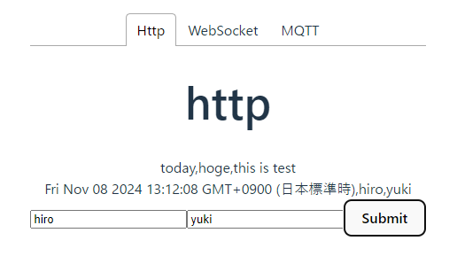

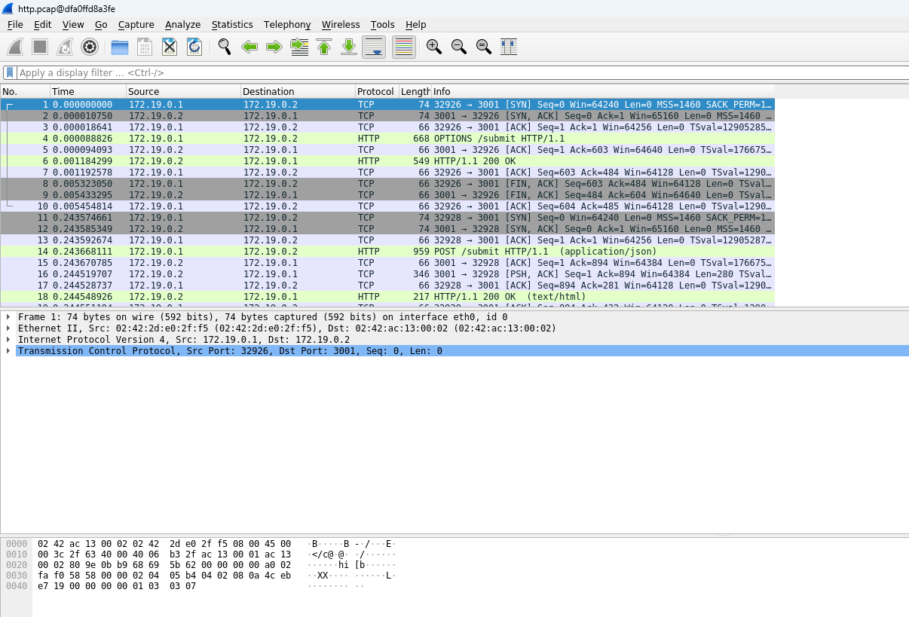
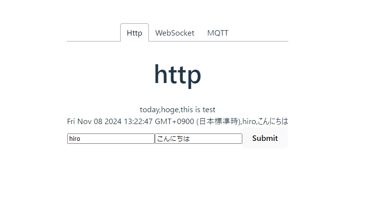
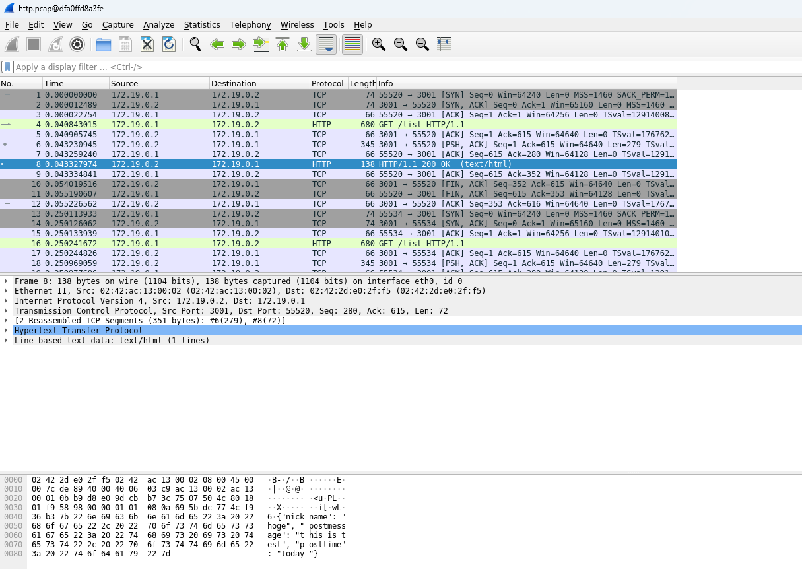

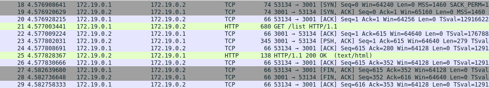

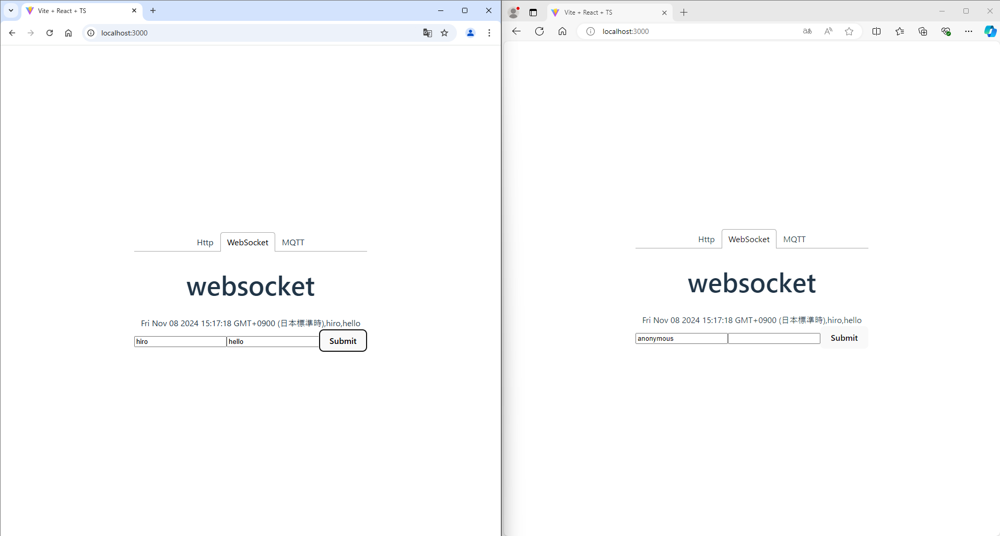

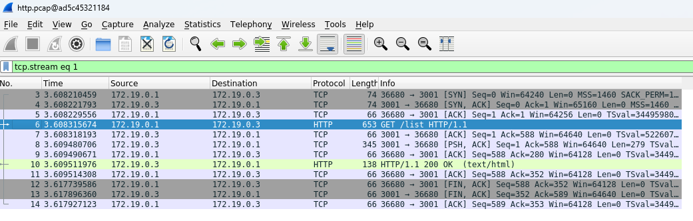

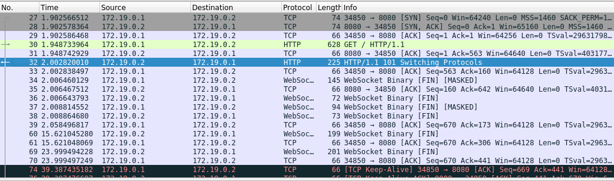

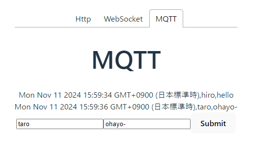
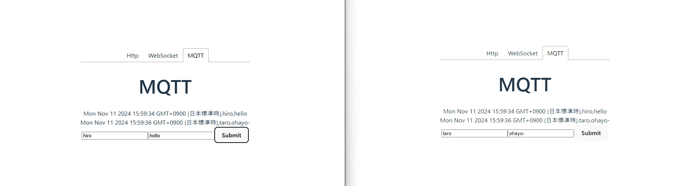
```
UYII8ceNiICh
```